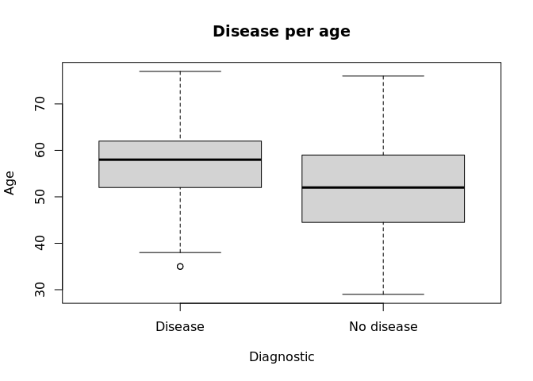
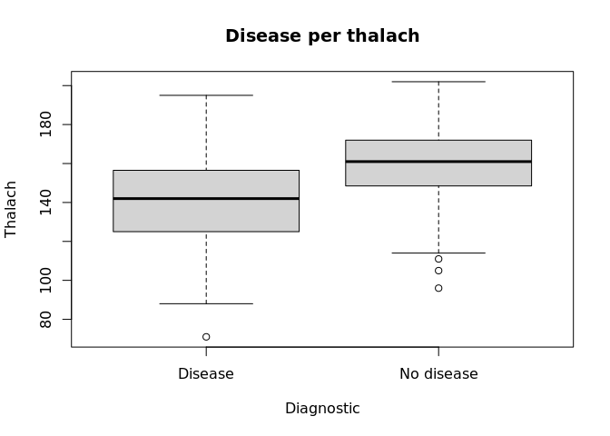
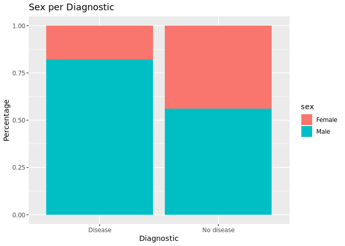

<!-- README.md is generated from README.Rmd. Please edit that file -->

# Heart rate risk

## Cardiovascular diseases and their relationship with maximum heart rate.

### 1.Risk factors in cardiovascular diseases.

Millions of people around the world get heart disease every year and it
is one of the leading causes of death in Mexico and the US. Statistical
analyzes have detected a wide variety of risk factors such as age, blood
pressure, cholesterol, diabetes, genetics, etc. In this project we will
perform statistical tests and regression models to analyze one factor:
the maximum heart rate that someone can reach while exercising and how
this is associated with a high probability of having heart disease.

We will start by reading the database obtained from mysql: heart_data
and we will observe the first lines of the database:

    #>   age sex cp trestbps chol fbs restecg thalach exang oldpeak slope ca thal
    #> 1  63   1  1      145  233   1       2     150     0     2.3     3  0    6
    #> 2  67   1  4      160  286   0       2     108     1     1.5     2  3    3
    #> 3  67   1  4      120  229   0       2     129     1     2.6     2  2    7
    #> 4  37   1  3      130  250   0       0     187     0     3.5     3  0    3
    #> 5  41   0  2      130  204   0       2     172     0     1.4     1  0    3
    #> 6  56   1  2      120  236   0       0     178     0     0.8     1  0    3
    #>   class
    #> 1     0
    #> 2     2
    #> 3     1
    #> 4     0
    #> 5     0
    #> 6     0

### 2.Convert the Variable Classes to a Binomial Variable 0,1 and rename the genders at sex variable .

Since the variable “class” has several events we will take 0 as the
non-event and 1, 2, 3 and 4 as an event so that 0 maps to 0 and 1, 2, 3,
4 maps to 1, we will use the “mutate” function and add the column hd.

We will rename the variable “sex” and convert it to a factor,so in this
case 0 will be for Female and 1 for Male.

    #>   age    sex cp trestbps chol fbs restecg thalach exang oldpeak slope ca thal
    #> 1  63   Male  1      145  233   1       2     150     0     2.3     3  0    6
    #> 2  67   Male  4      160  286   0       2     108     1     1.5     2  3    3
    #> 3  67   Male  4      120  229   0       2     129     1     2.6     2  2    7
    #> 4  37   Male  3      130  250   0       0     187     0     3.5     3  0    3
    #> 5  41 Female  2      130  204   0       2     172     0     1.4     1  0    3
    #> 6  56   Male  2      120  236   0       0     178     0     0.8     1  0    3
    #>   class hd
    #> 1     0  0
    #> 2     2  1
    #> 3     1  1
    #> 4     0  0
    #> 5     0  0
    #> 6     0  0

### 3.Identifying RELEVANT Variables.

Now we will use statistical tests to find out which ones are related to
heart disease. Depending on the type of data, we will use different
tests, for example for continuous variables we will use t-test and for
categorical variables we will use chi-square.

Recall that the t-test is used to determine whether the means of two
groups are significant. The chi test on its own examines whether two
variables are independent, in a general way whether the probability
distributions of two variables differ categorically.

1.  Chi test (function=chisq.test) between the sex variable and the hd
    variable, obtaining:

<!-- -->

    #> 
    #>  Pearson's Chi-squared test with Yates' continuity correction
    #> 
    #> data:  heartd$sex and heartd$hd
    #> X-squared = 22.043, df = 1, p-value = 2.667e-06

2.  Test t (t.test()), between the variables age and hd, obtaining:

<!-- -->

    #> 
    #>  Welch Two Sample t-test
    #> 
    #> data:  heartd$age by heartd$hd
    #> t = -4.0303, df = 300.93, p-value = 7.061e-05
    #> alternative hypothesis: true difference in means between group 0 and group 1 is not equal to 0
    #> 95 percent confidence interval:
    #>  -6.013385 -2.067682
    #> sample estimates:
    #> mean in group 0 mean in group 1 
    #>        52.58537        56.62590

3.  Test t (t.test()) between the variables thalach and hd, obtaining:

<!-- -->

    #> 
    #>  Welch Two Sample t-test
    #> 
    #> data:  heartd$thalach by heartd$hd
    #> t = 7.8579, df = 272.27, p-value = 9.106e-14
    #> alternative hypothesis: true difference in means between group 0 and group 1 is not equal to 0
    #> 95 percent confidence interval:
    #>  14.32900 23.90912
    #> sample estimates:
    #> mean in group 0 mean in group 1 
    #>         158.378         139.259

### 4.Exploring associations graphically.

In addition to the p-values that we already obtained, now we will
visualize with graphs age, sex, distributions of maximum heart rate,
this will make more sense in terms of the magnitude and direction of the
relationships of the variables. We first use the boxplot for the age
variable, since it is more ad hoc as it is a continuous variable. We
will create an additional variable with the mutate() function ,so we can
label the variable hd as follows: If hd=1 Disease, otherwise No disease.

<!-- --><!-- --><!-- -->

### 5.Create multivariate model (logistic model).

Observing the p\<0.001 tests in all the tests as well as the graphs, we
conclude that they are all relevant, so the next step will be to create
a regression that helps us predict the hd variable using the glm()
function.

    #> 
    #> Call:
    #> glm(formula = hd ~ age + sex + thalach, family = "binomial", 
    #>     data = heartd)
    #> 
    #> Deviance Residuals: 
    #>     Min       1Q   Median       3Q      Max  
    #> -2.2250  -0.8486  -0.4570   0.9043   2.1156  
    #> 
    #> Coefficients:
    #>              Estimate Std. Error z value Pr(>|z|)    
    #> (Intercept)  3.111610   1.607466   1.936   0.0529 .  
    #> age          0.031886   0.016440   1.940   0.0524 .  
    #> sexMale      1.491902   0.307193   4.857 1.19e-06 ***
    #> thalach     -0.040541   0.007073  -5.732 9.93e-09 ***
    #> ---
    #> Signif. codes:  0 '***' 0.001 '**' 0.01 '*' 0.05 '.' 0.1 ' ' 1
    #> 
    #> (Dispersion parameter for binomial family taken to be 1)
    #> 
    #>     Null deviance: 417.98  on 302  degrees of freedom
    #> Residual deviance: 332.85  on 299  degrees of freedom
    #> AIC: 340.85
    #> 
    #> Number of Fisher Scoring iterations: 4

### 6.Extract useful information from the multivariate model.

In the practice of medical research, when comparing risk variables, the
Odds Ratio (OR) is used to quantify how close the relationship is
between one variable or another. When OR \> 1 we say that it is
positively associated or high probability of association, otherwise we
say that it is negatively associated or low probability of association.

1.  We will use the broom package and convert the model information
    (“model” variable) to tiddy format.

<!-- -->

    #> # A tibble: 4 × 5
    #>   term        estimate std.error statistic       p.value
    #>   <chr>          <dbl>     <dbl>     <dbl>         <dbl>
    #> 1 (Intercept)   3.11     1.61         1.94 0.0529       
    #> 2 age           0.0319   0.0164       1.94 0.0524       
    #> 3 sexMale       1.49     0.307        4.86 0.00000119   
    #> 4 thalach      -0.0405   0.00707     -5.73 0.00000000993

b)Calculate OR.

    #> [1] 22.4571817  1.0323995  4.4455437  0.9602694

c)Calculate 95% lower and upper confidence intervals.

    #> # A tibble: 4 × 8
    #>   term        estimate std.error statistic      p.value     OR lower_CI upper_CI
    #>   <chr>          <dbl>     <dbl>     <dbl>        <dbl>  <dbl>    <dbl>    <dbl>
    #> 1 (Intercept)   3.11     1.61         1.94      5.29e-2 22.5      0.962  524.   
    #> 2 age           0.0319   0.0164       1.94      5.24e-2  1.03     1.00     1.07 
    #> 3 sexMale       1.49     0.307        4.86      1.19e-6  4.45     2.43     8.12 
    #> 4 thalach      -0.0405   0.00707     -5.73      9.93e-9  0.960    0.947    0.974

### 7.Model predictive probabilities.

We have created the logistic model, and we have examined the
coefficients or Odd Ratios, now the question is: can we use this model
to predict the probability that a person with some characteristic: age,
sex, maximum heart rate, has a heart disease? . Additionally, we would
like to translate predictive probability into a decision rule or
principle, so doctors when evaluating a patient have the ability to
predict the condition of their patients.

a)Using the predict() function together with the database we have, the
model info we will find the predictive probability of the \~300
observations.

    #>          1          2          3          4          5          6          7 
    #> 0.62973925 0.91383463 0.81906287 0.14209920 0.07214477 0.30422439 0.19811718 
    #>          8          9         10         11         12         13         14 
    #> 0.15720717 0.65762374 0.50238350 0.60369068 0.21321934 0.65299489 0.26753149 
    #>         15         16         17         18         19         20         21 
    #> 0.42405680 0.34678299 0.33694615 0.45976534 0.27029353 0.31719953 0.69130612 
    #>         22         23         24         25         26         27         28 
    #> 0.16704317 0.49156467 0.36336629 0.76227393 0.15451104 0.11793378 0.64436142 
    #>         29         30         31         32         33         34         35 
    #> 0.27728162 0.77854689 0.30788390 0.50750617 0.55938159 0.48940153 0.22262542 
    #>         36         37         38         39         40         41         42 
    #> 0.21863108 0.75205955 0.86765228 0.73218923 0.72994933 0.63702133 0.20793250 
    #>         43         44         45         46         47         48         49 
    #> 0.23286298 0.52990564 0.14247761 0.44116097 0.77610113 0.73272561 0.23490436 
    #>         50         51         52         53         54         55         56 
    #> 0.53274266 0.08378207 0.73111443 0.45106848 0.16585345 0.66344621 0.87060577 
    #>         57         58         59         60         61         62         63 
    #> 0.39880314 0.37878257 0.54067096 0.76169693 0.26520256 0.12917474 0.75803875 
    #>         64         65         66         67         68         69         70 
    #> 0.11318589 0.85121467 0.68130437 0.55792231 0.40999295 0.69188993 0.52763817 
    #>         71         72         73         74         75         76         77 
    #> 0.30662414 0.53285326 0.92869577 0.56722507 0.23697271 0.28139068 0.69004166 
    #>         78         79         80         81         82         83         84 
    #> 0.26520256 0.23804455 0.87575006 0.50955842 0.26975401 0.17777658 0.66608414 
    #>         85         86         87         88         89         90         91 
    #> 0.32925512 0.21568815 0.44464739 0.53476607 0.15642459 0.21367887 0.64249601 
    #>         92         93         94         95         96         97         98 
    #> 0.31217245 0.65956995 0.07042572 0.13555441 0.43398755 0.67434140 0.20746879 
    #>         99        100        101        102        103        104        105 
    #> 0.46406806 0.19675842 0.18819301 0.20317269 0.17990504 0.52625345 0.62963565 
    #>        106        107        108        109        110        111        112 
    #> 0.50021959 0.47927647 0.58413807 0.70531577 0.54270954 0.29683617 0.63440165 
    #>        113        114        115        116        117        118        119 
    #> 0.19134386 0.26290227 0.76060626 0.63630406 0.44116097 0.04105467 0.77917138 
    #>        120        121        122        123        124        125        126 
    #> 0.82161425 0.51320009 0.24546088 0.60641315 0.86496188 0.40657932 0.07254196 
    #>        127        128        129        130        131        132        133 
    #> 0.37876357 0.77155654 0.29202718 0.17950156 0.59043192 0.49657607 0.06530387 
    #>        134        135        136        137        138        139        140 
    #> 0.21231593 0.09915584 0.15951445 0.85418811 0.91718195 0.61043163 0.37749529 
    #>        141        142        143        144        145        146        147 
    #> 0.45908556 0.50966945 0.23182174 0.79138122 0.55218528 0.48496555 0.80120795 
    #>        148        149        150        151        152        153        154 
    #> 0.20651054 0.29866291 0.18818068 0.27791962 0.37865904 0.22466666 0.61744552 
    #>        155        156        157        158        159        160        161 
    #> 0.94003867 0.91807666 0.31346207 0.38232292 0.40723989 0.65700720 0.43678819 
    #>        162        163        164        165        166        167        168 
    #> 0.62034227 0.17191627 0.50373183 0.27673344 0.40372653 0.35665054 0.16622128 
    #>        169        170        171        172        173        174        175 
    #> 0.35321198 0.25956138 0.90845150 0.85733835 0.30905165 0.21815008 0.78460888 
    #>        176        177        178        179        180        181        182 
    #> 0.94549173 0.57492642 0.89399962 0.35592089 0.32734638 0.35529367 0.23433306 
    #>        183        184        185        186        187        188        189 
    #> 0.21863108 0.64708779 0.18206536 0.10559901 0.12760257 0.86330293 0.17076187 
    #>        190        191        192        193        194        195        196 
    #> 0.70777007 0.39880314 0.78306701 0.54417801 0.68807463 0.64966677 0.84186585 
    #>        197        198        199        200        201        202        203 
    #> 0.81648315 0.16578083 0.13449161 0.80488201 0.14928868 0.25141424 0.35602274 
    #>        204        205        206        207        208        209        210 
    #> 0.44035688 0.36526797 0.51968476 0.76539672 0.74830231 0.51831817 0.23960337 
    #>        211        212        213        214        215        216        217 
    #> 0.06909589 0.17316357 0.28902315 0.18644639 0.44397159 0.45546861 0.08357220 
    #>        218        219        220        221        222        223        224 
    #> 0.17023766 0.55137849 0.29033240 0.07214477 0.12598006 0.05206651 0.91997591 
    #>        225        226        227        228        229        230        231 
    #> 0.15044809 0.02690343 0.57559520 0.15120613 0.87510461 0.79519047 0.11087505 
    #>        232        233        234        235        236        237        238 
    #> 0.53045665 0.74224936 0.63775663 0.14494470 0.83514451 0.90144156 0.55781272 
    #>        239        240        241        242        243        244        245 
    #> 0.13082306 0.34864541 0.42751145 0.10071293 0.12628175 0.66151079 0.75635087 
    #>        246        247        248        249        250        251        252 
    #> 0.97939526 0.53206125 0.78889084 0.36600589 0.71189941 0.78797771 0.89989280 
    #>        253        254        255        256        257        258        259 
    #> 0.91585745 0.16421122 0.20368823 0.07156749 0.37544450 0.69680281 0.73848099 
    #>        260        261        262        263        264        265        266 
    #> 0.66921946 0.17856634 0.23124132 0.12922473 0.30047912 0.81470284 0.70579210 
    #>        267        268        269        270        271        272        273 
    #> 0.48428191 0.74120066 0.18861154 0.46542983 0.72188358 0.75273501 0.76946346 
    #>        274        275        276        277        278        279        280 
    #> 0.57635248 0.47927647 0.58910747 0.27964373 0.14098367 0.44329601 0.41339570 
    #>        281        282        283        284        285        286        287 
    #> 0.65103098 0.23961808 0.40009700 0.20838366 0.50534260 0.68505132 0.27726544 
    #>        288        289        290        291        292        293        294 
    #> 0.64906193 0.44543314 0.38641929 0.65895509 0.13417331 0.54203017 0.68446047 
    #>        295        296        297        298        299        300        301 
    #> 0.40294147 0.18729046 0.94459264 0.48562908 0.66527723 0.74181046 0.85305104 
    #>        302        303 
    #> 0.10667988 0.23174263

b)Create a decision rule using probability 0.5 as cutoff and save the
predicted decision into the main data frame.

heartd$pred_hd \<- ifelse(pred_prob>=.5,1,0)

### 8.Testing the model.

a)We create a new patient who arrives for an appointment.

    #>   age  sex thalach
    #> 1  60 Male     120

b)We predict the probability that this patient has heart disease.

    #> The probability that this patient has heart disease is 83.9119 %
